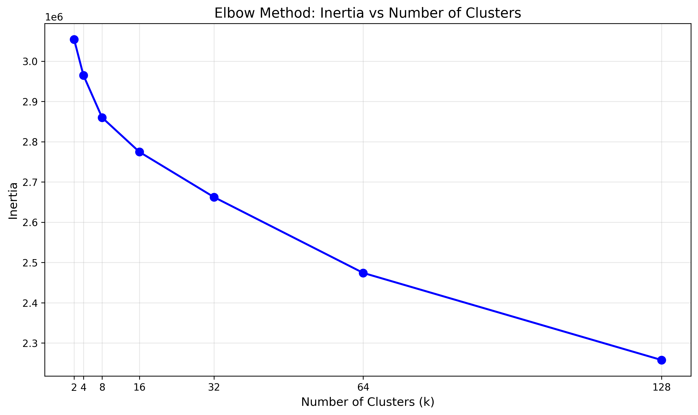
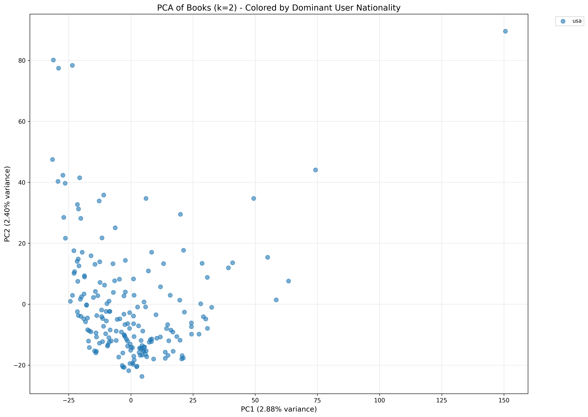
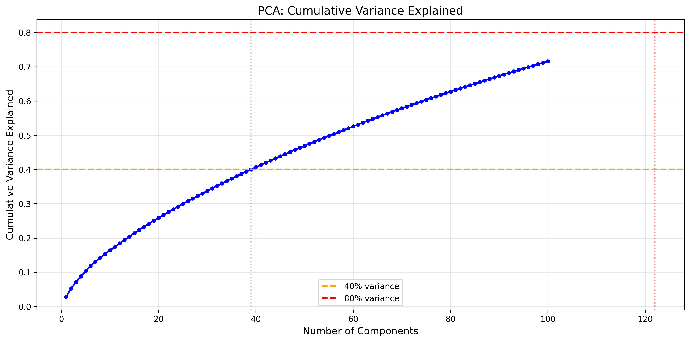
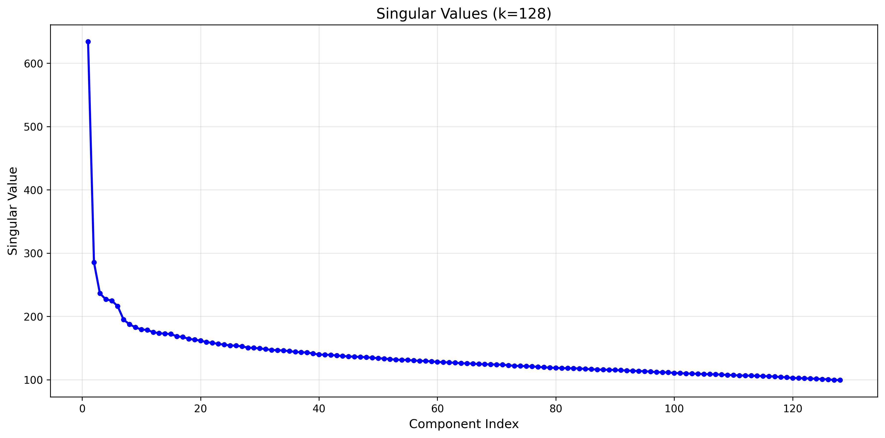
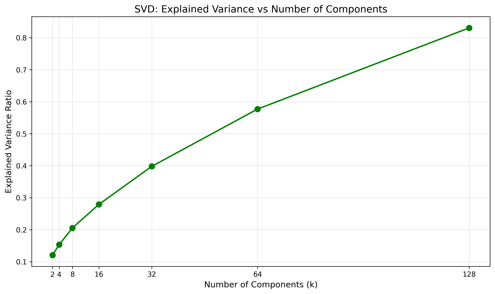
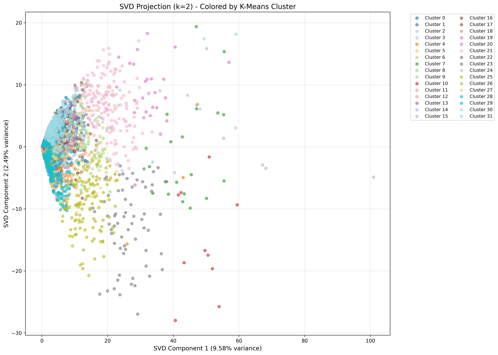

# Book Ratings: Clustering, PCA & SVD Analysis

Segmenting readers into distinct preference groups and exploring the underlying dimensionality of book rating behavior using the Book-Crossing dataset.

## Problem

Can user rating behavior be used to identify meaningful reader segments, and how many dimensions does it actually take to describe someone's reading preferences? This project explores both questions using unsupervised learning on a large, messy, real-world ratings dataset.

## Data

- **Source:** [Book-Crossing dataset](https://www.kaggle.com/datasets/somnambwl/bookcrossing-dataset) — ~280,000 users and their book ratings
- **Cleaning:** Handled malformed CSV rows (unescaped characters in titles), and treated 0-star ratings as missing data rather than true "zero" ratings, imputing them with each book's mean rating (excluding zeros)
- **Filtering:** Kept books with 200+ ratings and users with 5+ ratings to focus on statistically meaningful patterns
- **Final structure:** A user × book ratings matrix built via pivot table, covering 11,794 users after filtering

## Clustering (K-Means)

Tested k = [2, 4, 8, 16, 32, 64, 128] and selected k=32 using the elbow method on inertia:

Clusters captured recognizable reading segments — Harry Potter/fantasy readers, commercial thriller readers (Grisham, Patterson, Evanovich), classic literature readers — but were highly imbalanced: one cluster held **7,282 of ~11,800 users (~70%)**, while several others had fewer than 10.

## PCA

Reduced the (mean-centered, transposed) matrix to 2 components for visualization, then computed cumulative explained variance across all components to find the data's true dimensionality:

2D PCA captured only **5.28% of total variance**; reaching 80% cumulative variance required **122 components** — confirming that reading preferences are high-dimensional and don't collapse neatly into 2 axes.

## SVD

Applied Truncated SVD at multiple component counts and compared explained variance retention against the PCA and clustering results:

SVD at k=128 retained **83.06%** of variance, consistent with the PCA findings. Projecting the 32 k-means clusters into 2D SVD space shows heavy overlap — the cluster separations exist in dimensions beyond what a 2D plot can show, not because the clustering itself failed.

## Limitations

- Many "top-rated" books per cluster were based on just 1–2 ratings, making some cluster averages unreliable despite technically valid math
- Popular titles (Harry Potter, To Kill a Mockingbird) appeared across many clusters, suggesting some measured "preference" is really just broad popularity rather than a distinct taste signal
- The dominant single large cluster suggests k=32 may have fragmented what is more accurately a smaller number of robust, distinct segments plus one large "mainstream" group

## Tools

Python, Pandas, NumPy, scikit-learn (KMeans, PCA, TruncatedSVD), Matplotlib
